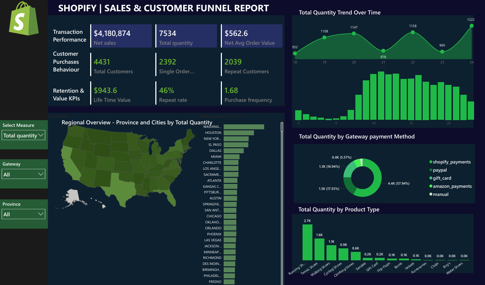

# 🛍️ Shopify Sales & Customer Funnel Dashboard – Power BI

This project presents a fully interactive **Power BI dashboard** that analyzes sales, customer behavior, and transaction performance data from a Shopify store. It is designed to offer actionable insights into transaction trends, customer retention, and regional performance to support data-driven decision-making.

## 🎯 Purpose

The goal of this dashboard is to:

- 📈 Visualize end-to-end Shopify sales funnel metrics  
- 🌍 Identify regional and product-level sales patterns  
- 🔁 Evaluate repeat customer behavior and retention KPIs  
- 💳 Analyze preferred payment methods used by customers  

---

## 📷 Dashboard Preview



---

## 📊 Dashboard Features

### 🔹 Transaction Performance
This section provides a quick overview of total revenue and sales performance:
- 💰 **Net Sales**: $4.18M – Total revenue from completed transactions.
- 📦 **Total Quantity Sold**: 7,534 – Number of items sold.
- 💳 **Average Order Value (AOV)**: $562.6 – Calculated from total sales and orders.

### 🔹 Customer Purchase Behavior
Gain insight into customer types and buying patterns:
- 👤 **Total Customers**: 4,431 unique customers.
- 🛒 **Single Order Customers**: 2,392 – First-time or one-time buyers.
- 🔁 **Repeat Customers**: 2,039 – Returning customers, contributing to customer loyalty.

### 🔹 Retention & Value KPIs
Essential retention metrics for tracking customer lifetime value:
- ♻️ **Repeat Rate**: 46% – Percentage of customers making multiple purchases.
- 💵 **Customer Lifetime Value (CLTV)**: $943.6 – Avg. value each customer brings over time.
- 🔄 **Purchase Frequency**: 1.68 – Average number of times a customer purchases.

### 🔹 Interactive Visuals
The dashboard supports dynamic filtering and multi-dimensional analysis through:
- 📈 **Time-Based Quantity Trend**: Daily and hourly sales volume trends.
- 🗺️ **Geographic Overview**: Map and bar charts showing top-performing states and cities.
- 💳 **Payment Gateway Distribution**: Analyze transactions by Shopify, PayPal, Amazon, Gift Cards, and Manual payments.
- 👟 **Product Category Breakdown**: Identify top-selling product types and trends.
- 🎯 **Dynamic Slicers**: Filter by Gateway, Province, and Metric to explore data from various angles.

---

## 📌 Filters & Slicers

The dashboard includes dynamic filters to enhance user exploration:

- 🎯 **Measure Selector**: Switch between key metrics like total quantity, net sales, etc.  
- 💳 **Payment Gateway**: Filter by transaction method (Shopify, PayPal, Gift Card, Manual, etc.)  
- 🗺️ **Province**: Drill down into specific US states for regional insights  

---

## 📁 Repository Contents

```text
Shopify-Sales-Dashboard/
├── shopify.pbix                    # Main Power BI file
├── Dashboard.png                   # Dashboard preview image (used in README)
├── shopify.pdf                     # Optional downloadable PDF version
├── Shopify Sales.xlsx              # Cleaned or mock sample data
└── README.md                       # This documentation
